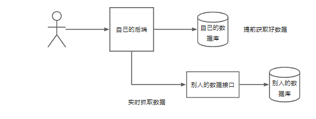

数据抓取的几种方式
1. 直接使用httpclient， okHTTp， RestTemplate， Hutool等工具
2. 当网页渲染过后，从前端抓取页面的内容数据
3. 有一些网站是动态请求的，他不会一次加载所有的数据，而是点某一个按钮，输入验证码才会显示出数据，使用selenium
用户获取：
1. 一般都是用户自己

图片获取
实时抓取：网站本身是不存储数据的，用户搜的时候，直接从别人的接口去搜

使用抓取能够渲染过的图片：
找到murl这个地址
尝试使用一个Go的一个爬虫库