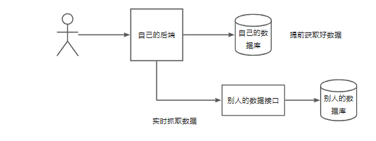
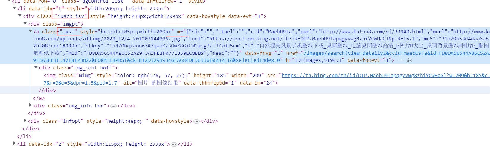

数据抓取的几种方式
1. 直接使用httpclient， okHTTp， RestTemplate， Hutool等工具
2. 当网页渲染过后，从前端抓取页面的内容数据
3. 有一些网站是动态请求的，他不会一次加载所有的数据，而是点某一个按钮，输入验证码才会显示出数据，使用selenium
用户获取：
1. 一般都是用户自己

图片获取
实时抓取：网站本身是不存储数据的，用户搜的时候，直接从别人的接口去搜

我们要获取的图片其实就相当于一个转发
使用抓取来获得能够渲染过的图片：
找到元素: .iuscp.isv
在元素里面   找到murl后面跟着的这个地址
尝试使用一个Go的一个爬虫库colly来实现

m：它是 iusc 类中的一个属性，表示图像的元数据（metadata）。m 属性通常包含有关图像的信息，例如图像的宽度、高度、大小、类型等。该属性通常用于在客户端代码中访问图像元数据。

purl：这是 iusc 类中的另一个属性，表示图像的原始 URL（Primary URL）。purl 属性包含指向图像的原始来源的 URL，也就是直接访问图像的地址。

murl：这是 iusc 类中的属性之一，表示图像的媒体 URL（Media URL）。murl 属性提供了指向图像的媒体资源（例如图片、视频）的 URL。在某些情况下，murl 可能会与 purl 相同，或者指向不同的图像版本（例如缩略图）或其他相关媒体。

turl：类似于 murl，turl 也是 iusc 类中的属性之一，表示图像的缩略图 URL（Thumbnail URL）。turl 属性提供了指向图像缩略图的 URL，通常用于在搜索结果中显示图像的缩略版本。